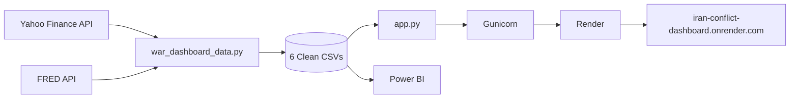

# Iran Conflict Dashboard

[](https://www.python.org/)
[](LICENSE)
[](https://iran-conflict-dashboard.onrender.com)

Real-time economic war dashboard tracking the financial impact of the Iran conflict (D0 = Feb 28, 2026) on global markets. A two-component system: a Python data pipeline that pulls and normalizes 16+ economic series across 4 asset classes, and a deployed Plotly Dash web app with interactive charts, KPI cards, and a geopolitical alerts ticker.

---

## Data Pipeline

`war_dashboard_data.py` handles all data acquisition, normalization, and export. Nothing in the frontend touches an API — the pipeline runs independently and the dashboard reads static files.

**Multi-source ingestion.** Market data comes from two sources with different authentication patterns. Yahoo Finance is accessed via `yfinance` with no credentials required — the library handles the HTTP layer transparently. FRED requires an API key, read at runtime from the `FRED_API_KEY` environment variable and passed to the `fredapi.Fred` client:

```python
import os
from fredapi import Fred

fred = Fred(api_key=os.environ["FRED_API_KEY"])
```

The 16 Yahoo Finance tickers span four asset classes: energy and commodities (`BZ=F`, `GC=F`, `CL=F`, `NG=F`), global equity indices (`^GSPC`, `^STOXX50E`, `^N225`, `^TA125.TA`, `^BSESN`, `^FTSE`, `^GDAXI`), FX and volatility (`EURUSD=X`, `^VIX`, `DX=F`, `USDILS=X`), and US sovereign rates sourced from FRED (`DGS10`, `DGS2`).

**Index normalization.** Every series is independently rebased to 100 at `CONFLICT_START` (Feb 28, 2026). This makes cross-asset relative performance directly comparable regardless of price scale — a 10-point move in Brent means the same as a 10-point move in the S&P 500 index:

```python
CONFLICT_START = "2026-02-28"

def normalize(series: pd.Series) -> pd.Series:
    base = series.loc[CONFLICT_START]
    return (series / base) * 100
```

When the exact start date falls on a non-trading day, the pipeline finds the nearest available observation rather than raising an error.

**Data quality handling.** Missing trading days are forward-filled so the normalized series remain continuous. Each ticker is checked against a 10% missingness threshold — if a series has more than 10% NaN values after download, the pipeline logs a warning rather than silently producing a degraded output. More importantly, each ticker is downloaded in an individual `yfinance` call rather than in batch. This isolates failures: a single broken ticker emits a warning and is skipped, while the rest of the run completes normally.

Several production-specific issues were resolved during development. `yfinance` in newer versions returns a MultiIndex DataFrame with columns structured as `("Close", "TICKER")` tuples instead of a flat `"Close"` column — the pipeline handles both shapes. `DX-Y.NYB` (the DXY Dollar Index) is broken on Yahoo Finance and was substituted with `DX=F`, the futures contract. On Windows, printing symbols like `Δ` or `€` to the console raises a `cp1252` encoding error; all console output is encoded explicitly to avoid this.

**Output schema.** The pipeline writes eight files: six asset-class CSVs (`energy_commodities.csv`, `equity_indices.csv`, `fx_volatility.csv`, `us_rates.csv`, `snapshot_table.csv`, `alerts.csv`) plus two master files — `all_series_wide.csv` containing raw prices and `all_series_indexed.csv` containing the normalized series. Both Dash and Power BI read from these files directly, with no additional transformation layer between the pipeline output and either consumer.

The output CSVs are the single source of truth consumed by the frontend — zero API calls occur at dashboard runtime.

---


---

## Architecture



---

## Features

- **6 KPI cards** — Brent, Gold, VIX, DXY, US 10Y yield, 2Y–10Y spread
- **Indexed performance chart** — 16 series normalized to D0=100, with a series selector
- **Equity returns bar chart** — 7 global indices since D0
- **Dual-axis chart** — Brent crude vs US 10Y yield with range slider
- **Snapshot table** — full dataset with conditional formatting on Δ7d and ΔD0 columns
- **Geopolitical alerts ticker** — scrolling, severity-coded alerts
- **CI/CD deployment** — auto-deploys on push via Render + GitHub integration

---

## Tech Stack

| Tool | Purpose |
|---|---|
| Python 3.11 | Core language |
| pandas | Data wrangling and normalization |
| yfinance | Yahoo Finance market data |
| fredapi | FRED macroeconomic series |
| Plotly Dash | Interactive web dashboard |
| Dash Bootstrap Components | Layout and styling |
| Gunicorn | Production WSGI server |
| Render | Cloud hosting + CI/CD |
| Power BI | Parallel local dashboard (CSV-fed) |

---

## Local Setup

**1. Clone the repository**
```bash
git clone https://github.com/DylanG98/iran-conflict-dashboard.git
cd iran-conflict-dashboard
```

**2. Install dependencies**
```bash
pip install -r requirements.txt
```

**3. Set your FRED API key**

Get a free key at [fred.stlouisfed.org/docs/api/api_key.html](https://fred.stlouisfed.org/docs/api/api_key.html), then:

```bash
export FRED_API_KEY=your_key_here   # Linux / macOS
set FRED_API_KEY=your_key_here      # Windows CMD
```

**4. Run the data pipeline**
```bash
python war_dashboard_data.py
```
This downloads and processes all series, outputting 6 CSVs to the `data/` directory.

**5. Run the dashboard**
```bash
python app.py
```
Open [http://localhost:8050](http://localhost:8050) in your browser.

---

## Project Structure

```
iran-conflict-dashboard/
├── app.py                    # Dash application and layout
├── war_dashboard_data.py     # Data pipeline (download, process, export)
├── requirements.txt
├── assets/
│   └── screenshot.png
├── data/                     # Generated CSVs (git-ignored)
│   ├── energy_commodities.csv
│   ├── equity_indices.csv
│   ├── fx_volatility.csv
│   ├── us_rates.csv
│   ├── snapshot_table.csv
│   └── alerts.csv
└── README.md
```

---

## Data Sources

- **Yahoo Finance** — equity indices, commodities, FX, volatility ([finance.yahoo.com](https://finance.yahoo.com))
- **FRED (Federal Reserve Economic Data)** — US Treasury yields and spreads ([fred.stlouisfed.org](https://fred.stlouisfed.org))

All series are normalized to an index value of 100 at D0 (Feb 28, 2026) for conflict-relative comparison.

---

## Author

**Dylan Guzman** — Final-year Economics student at Universidad Nacional de La Plata (UNLP), Argentina.

- GitHub: [@DylanG98](https://github.com/DylanG98)
- LinkedIn: [linkedin.com/in/dylanguzman98](https://www.linkedin.com/in/dylanguzman98)

---

## License

[MIT](LICENSE)
